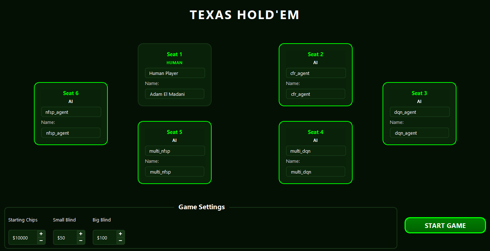

# Apprentissage par Renforcement Multi-Agent pour le Texas Hold'em No-Limit

## Aperçu du Projet

Ce projet implémente et compare **trois algorithmes d'Apprentissage par Renforcement de pointe** pour jouer au **Texas Hold'em No-Limit à 6 joueurs**. Le système propose à la fois un entraînement d'agents individuels et un paradigme unique d'**entraînement multi-agent** où divers agents apprennent simultanément à une même table.



---

## Comprendre le Texas Hold'em Poker

### Qu'est-ce que le Poker ?
Le Texas Hold'em est un **jeu de poker à cartes communes** où les joueurs s'affrontent pour gagner des jetons en :
1. Ayant la **meilleure main de 5 cartes** à l'abattage, ou
2. Faisant **se coucher** tous les adversaires (abandonner leur main)

### La Configuration
| Élément | Description |
|---------|-------------|
| **Joueurs** | 2-10 joueurs à une table (notre projet utilise 6) |
| **Paquet** | Paquet standard de 52 cartes |
| **Blinds** | Mises forcées pour créer l'action (Petite Blind + Grosse Blind) |
| **Bouton Dealer** | Tourne à chaque main pour déterminer l'ordre des mises |

### Déroulement d'une Main

```
┌─────────────────────────────────────────────────────────────────┐
│                 DÉROULEMENT D'UNE MAIN DE TEXAS HOLD'EM         │
├─────────────────────────────────────────────────────────────────┤
│  1. PREFLOP    →  2. FLOP      →  3. TURN    →  4. RIVER       │
│  (2 cartes      (3 cartes       (+1 carte)    (+1 carte)       │
│   privées)       communes)                                      │
│                                                                 │
│  [?][?]           [A♠][K♥][7♦]   [A♠][K♥][7♦]  [A♠][K♥][7♦]   │
│                                   [Q♣]          [Q♣][2♠]       │
└─────────────────────────────────────────────────────────────────┘
```

### Tours de Mises
Chaque phase comporte un tour de mises où les joueurs peuvent :

| Action | Description |
|--------|-------------|
| **Fold (Se coucher)** | Abandonner la main, perdre les mises effectuées |
| **Check (Parole)** | Passer l'action (seulement si aucune mise à suivre) |
| **Call (Suivre)** | Égaliser la mise actuelle |
| **Bet/Raise (Miser/Relancer)** | Augmenter la mise |
| **All-In (Tapis)** | Engager tous ses jetons restants |

### Classement des Mains (De la Plus Forte à la Plus Faible)

| Rang | Main | Exemple |
|------|------|---------|
| 1 | **Quinte Flush Royale** | A♠ R♠ D♠ V♠ 10♠ |
| 2 | **Quinte Flush** | 9♥ 8♥ 7♥ 6♥ 5♥ |
| 3 | **Carré** | R♠ R♥ R♦ R♣ 7♠ |
| 4 | **Full** | D♠ D♥ D♦ 8♣ 8♠ |
| 5 | **Couleur** | A♦ V♦ 8♦ 6♦ 2♦ |
| 6 | **Suite** | 10♣ 9♠ 8♥ 7♦ 6♣ |
| 7 | **Brelan** | 7♠ 7♥ 7♦ R♣ 3♠ |
| 8 | **Double Paire** | V♠ V♥ 4♦ 4♣ A♠ |
| 9 | **Paire** | 10♠ 10♥ R♦ 5♣ 2♠ |
| 10 | **Carte Haute** | A♠ D♥ 9♦ 6♣ 3♠ |

### Pourquoi le Poker est Difficile pour l'IA

1. **Information Imparfaite** : On ne voit pas les cartes des adversaires
2. **Bluff** : Le jeu optimal nécessite la tromperie
3. **Modélisation des Adversaires** : La stratégie dépend de qui on affronte
4. **Espace d'États Immense** : ~10^160 états de jeu possibles en No-Limit Hold'em
5. **Récompenses Différées** : Le résultat n'est connu qu'à la fin de la main

---

## Objectifs

1. **Implémenter des Algorithmes RL pour le Poker** : Entraîner des agents DQN, NFSP et CFR avec le framework RLCard
2. **Environnement d'Entraînement Multi-Agent** : Créer un setup collaboratif/compétitif avec 6 agents apprenant ensemble
3. **Comparaison de Performance** : Évaluer rigoureusement les agents via des tournois
4. **Application de Poker Interactive** : Construire une interface graphique où les humains peuvent affronter l'IA

---

## Algorithmes d'Apprentissage par Renforcement

### 1. Deep Q-Network (DQN)
**Catégorie** : RL Basé sur la Valeur

| Composant | Description |
|-----------|-------------|
| **Architecture** | Perceptron Multi-Couches (512 → 512 unités cachées) |
| **Représentation d'État** | Vecteur de 54 dimensions (52 bits de cartes + comptage normalisé des jetons) |
| **Espace d'Actions** | 5 actions discrètes : Fold, Check/Call, Relance Demi-Pot, Relance Pot, All-In |
| **Méthode d'Apprentissage** | Experience replay avec mises à jour du réseau cible |

**Principe Clé** : DQN apprend une fonction Q qui estime la récompense cumulative attendue pour chaque action, puis sélectionne l'action avec la valeur Q la plus élevée.

---

### 2. Neural Fictitious Self-Play (NFSP)
**Catégorie** : RL Théorie des Jeux

| Composant | Description |
|-----------|-------------|
| **Architecture** | Double réseau : Réseau de Politique + Réseau Q (512 → 512 chacun) |
| **Stratégie** | Approxime l'Équilibre de Nash par auto-jeu |
| **Mélange** | ε-greedy entre meilleure réponse et stratégie moyenne |

**Principe Clé** : NFSP combine l'apprentissage par renforcement avec l'apprentissage supervisé. Il maintient une "stratégie moyenne" qui converge vers un équilibre de Nash.

**Pourquoi NFSP pour le Poker ?** Le poker est un jeu à information imparfaite où les stratégies exploitables peuvent être contre-exploitées. NFSP recherche un jeu inexploitable.

---

### 3. Counterfactual Regret Minimization (CFR)
**Catégorie** : Minimisation du Regret

| Composant | Description |
|-----------|-------------|
| **Méthode** | Apprentissage tabulaire/politique via calcul de valeur contrefactuelle |
| **Garantie** | Converge vers l'Équilibre de Nash dans les jeux finis |
| **Défi** | Coûteux en calcul pour les grands arbres de jeu |

**Principe Clé** : CFR calcule le "regret" de ne pas avoir pris chaque action à chaque point de décision, puis met à jour la stratégie pour minimiser le regret cumulé.

**Note Historique** : Les méthodes basées sur CFR ont été utilisées pour créer **Libratus** et **Pluribus**, les premiers systèmes IA à battre des joueurs professionnels de poker.

---

## Architecture du Système

```
PokerVision2/
├── train_rlcard.py          # Entraînement agent individuel (DQN, NFSP, CFR)
├── train_multi_agent.py     # Entraînement multi-agent 6 joueurs
├── compare_agents.py        # Évaluation par tournoi
├── main.py                  # Lanceur de l'application GUI
│
├── src/
│   ├── engine/              # Logique du jeu
│   │   ├── game.py          # Implémentation complète du Texas Hold'em
│   │   ├── deck.py          # Abstraction Carte/Paquet
│   │   ├── hand_evaluator.py# Classement des mains
│   │   └── pot.py           # Gestion des pots secondaires
│   │
│   ├── players/             # Implémentations des joueurs
│   │   ├── base_player.py   # Interface joueur abstraite
│   │   ├── human_player.py  # Joueur contrôlé par GUI
│   │   ├── rlcard_player.py # Adaptateur agent DQN/NFSP
│   │   └── cfr_player.py    # Adaptateur agent CFR
│   │
│   └── ui/                  # Interface graphique PyQt6
│
└── models/                  # Checkpoints des modèles sauvegardés
    ├── dqn_agent.pth        # DQN Normal (~3.6 Mo)
    ├── nfsp_agent.pth       # NFSP Normal (~4.8 Mo)
    ├── cfr_agent.pth        # CFR Normal (~18 Mo)
    ├── multi_dqn.pth        # DQN Multi-agent (~18 Mo)
    └── multi_nfsp.pth       # NFSP Multi-agent (~18 Mo)
```

---

## Paradigmes d'Entraînement

### Entraînement Normal (Auto-Jeu)
```
Agent ←→ Adversaire(s) DQN
```
Chaque agent s'entraîne contre des adversaires DQN statiques dans un environnement à 2 joueurs.

### Entraînement Multi-Agent (Table Collaborative)
```
┌─────────────────────────────────────────────────┐
│              Table à 6 Joueurs                  │
├───────┬───────┬──────┬───────┬───────┬─────────┤
│ DQN₁  │ NFSP₁ │ CFR  │ DQN₂  │ NFSP₂ │ Random  │
│  (A)  │  (A)  │ (A)  │  (A)  │  (A)  │   (B)   │
└───────┴───────┴──────┴───────┴───────┴─────────┘
              A = Apprenant, B = Baseline
```

**Avantages de l'Entraînement Multi-Agent :**
- Les agents apprennent contre des **stratégies diverses**
- Évite le surapprentissage à un seul adversaire
- Simulation plus réaliste de la dynamique du poker
- Les agents doivent gérer l'**adaptation simultanée** de 5 autres apprenants

---

## Méthodologie d'Évaluation

### Tournoi Confrontation Directe
Format round-robin : chaque agent joue 1000 parties contre chaque autre agent.

**Métriques Collectées :**
- Gain moyen par partie
- Matrice de taux de victoire
- Classement global des agents

### Visualisations Produites
1. **Heatmap de Matrice de Gains** : Montre les gains tête-à-tête
2. **Graphique de Classement** : Performance moyenne contre tous les adversaires

---

## Détails Techniques

### Représentation d'État (54 dimensions)
```
[0-51]:  Encodage one-hot des cartes (52 cartes uniques)
[52]:    Nombre de jetons normalisé de l'agent
[53]:    Jetons normalisés des adversaires
```

### Espace d'Actions (5 actions discrètes)
| ID | Action | Description |
|----|--------|-------------|
| 0 | FOLD | Abandonner la main |
| 1 | CHECK/CALL | Égaliser la mise actuelle |
| 2 | RAISE_HALF_POT | Relancer de 50% du pot |
| 3 | RAISE_POT | Relancer de 100% du pot |
| 4 | ALL_IN | Engager tous les jetons |

### Configuration d'Entraînement
- **Épisodes** : 100 000 par agent
- **Réseau** : MLP [512, 512]
- **Appareil** : GPU (si disponible)
- **Graine** : 42 (reproductibilité)

---

## Technologies Utilisées

| Technologie | Objectif |
|-------------|----------|
| **Python 3.10+** | Langage principal |
| **RLCard** | Environnement RL et implémentations d'agents |
| **PyTorch** | Framework d'apprentissage profond |
| **PyQt6** | Interface graphique utilisateur |
| **NumPy** | Calculs numériques |
| **Matplotlib** | Visualisation et graphiques |

---

## Comment Exécuter

```bash
# Entraîner les agents individuels
python train_rlcard.py

# Entraînement multi-agent
python train_multi_agent.py

# Lancer le tournoi de comparaison
python compare_agents.py

# Lancer l'interface pour jouer contre l'IA
python main.py
```

---

## Points Clés à Retenir

1. **RL pour les Jeux** : Démontre l'application du RL moderne aux jeux multi-joueurs complexes
2. **Comparaison d'Algorithmes** : Comparaison pratique des approches basées sur la valeur (DQN), théorie des jeux (NFSP) et minimisation du regret (CFR)
3. **Apprentissage Multi-Agent** : Paradigme d'entraînement novateur avec des apprenants simultanés divers
4. **Système Complet** : Pipeline complet de l'entraînement à l'évaluation au jeu interactif

---

## Références

1. Mnih et al. (2015) - *Human-level control through deep reinforcement learning* (DQN)
2. Heinrich & Silver (2016) - *Deep Reinforcement Learning from Self-Play in Imperfect-Information Games* (NFSP)
3. Zinkevich et al. (2007) - *Regret Minimization in Games with Incomplete Information* (CFR)
4. Brown & Sandholm (2019) - *Superhuman AI for multiplayer poker* (Pluribus)
5. RLCard Toolkit - [https://github.com/datamllab/rlcard](https://github.com/datamllab/rlcard)

---

## License

This project is licensed under the MIT License - see the [LICENSE](LICENSE) file for details.